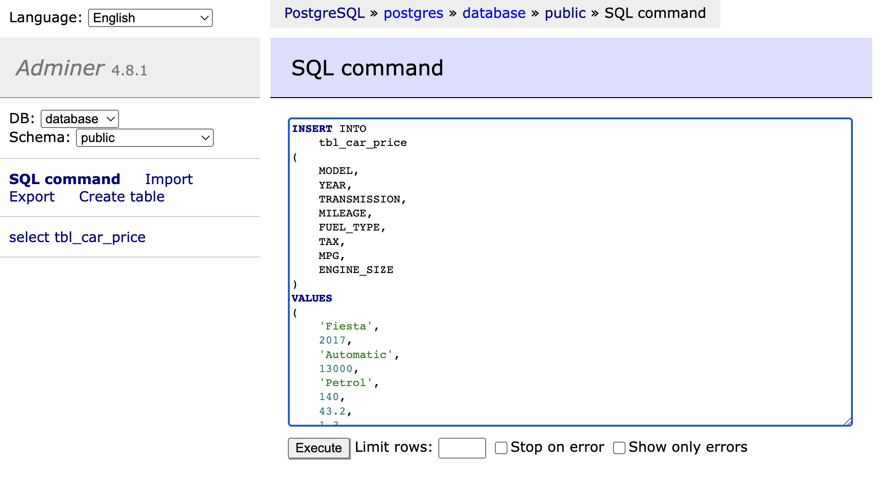
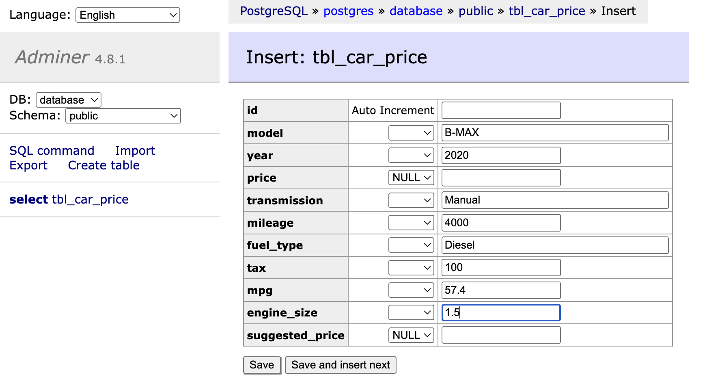
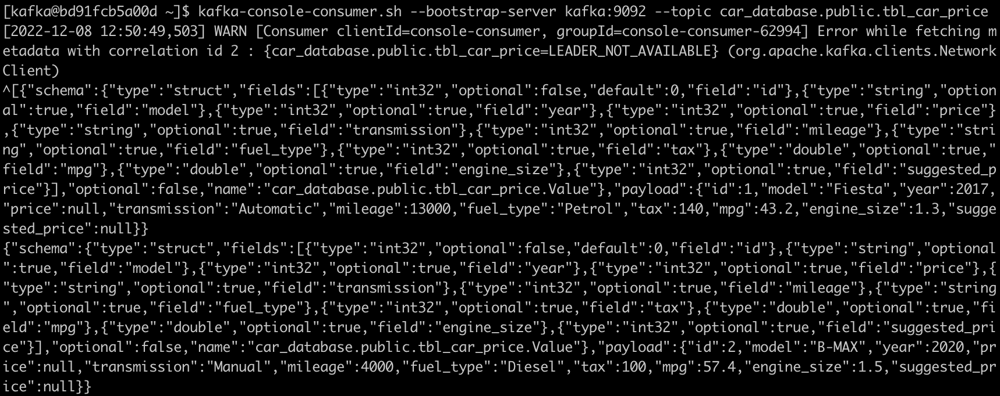
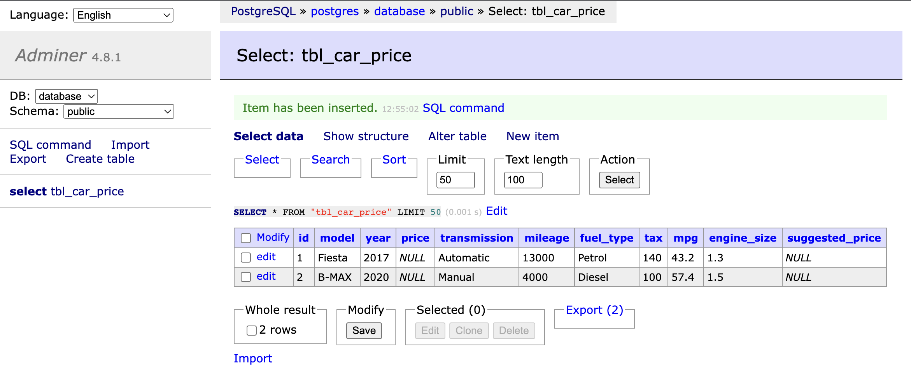
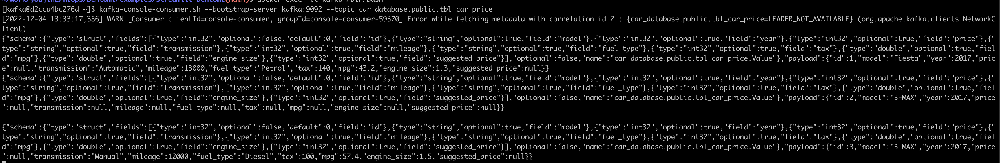
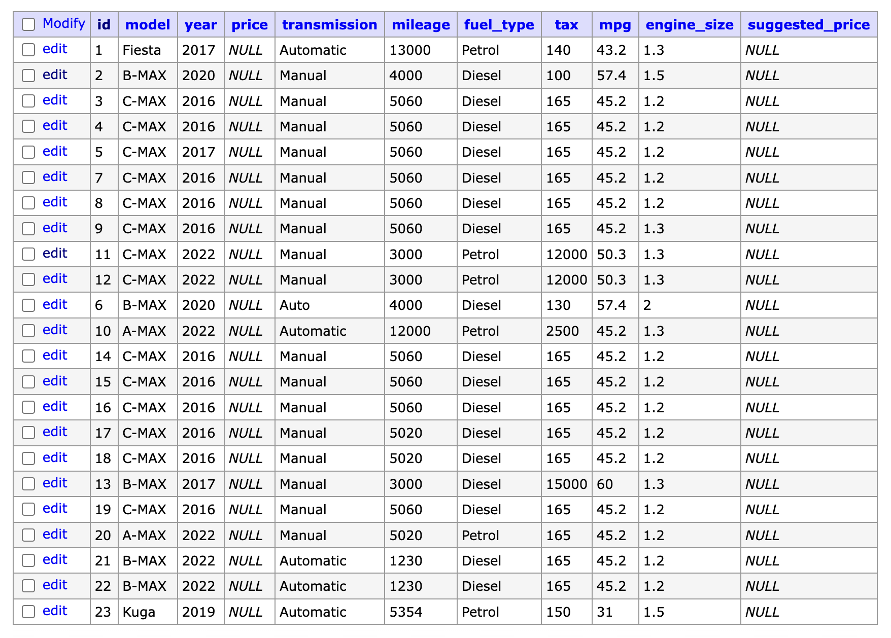
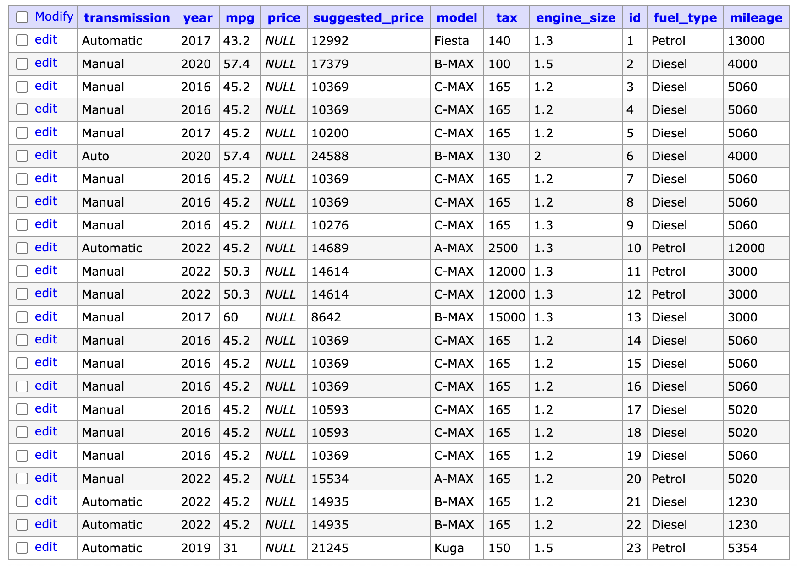

## Introduction
In this project, we will cover a brief introduction to ML serving pipeline processing real-time streaming data with `Apache Kafka`. 
More specifically, we will use `Debezium` to automatically capture changes of the database, and `BentoML` to serve the ML model and get the predictions for the target event. 
A detailed description to these frameworks will be covered in later sections. 

Dataset used in this project is `Ford car price prediction dataset` providede by `Kaggle`. 
The goal is to predict the price of used car given information such as the year, transmission type, and engine size etc, and we are going to train `XGBoostRegressor` to build ML model predicting the used car price.


## Dependencies
Dependencies required to reproduce this project are:
- Docker
- docker-compose
- Python >= 3.9
- bentoml==1.0.6


## Train & Deploy Bentoml Model
[BentoML] is an unified model serving framework that enables ML engineers to accelerate and standardize the process of taking ML models into production.
As mentioned in the `Introduction`, we will use `BentoML` as a framework to serve the ML model throughout this project.
If you are a beginner to `BentoML`, [Tutorial: Intro to BentoML] would be a nice introduction.  
Now, let's get start training our car price predicting model.

**i) Build python-dev environment used to train and deploy our ML model**
```bash
$ docker-compose -f docker-compose-dev.yml build

# check that the "streaming-ml-jupyter" image created
$ docker images

# output:
REPOSITORY                                        TAG                IMAGE ID       CREATED        SIZE
streaming-ml-jupyter                              0.1.0              5b4e80dc8277   2 weeks ago    2.13GB

# run docker container for training the model
$ docker-compose -f docker-compose-dev.yml up -d
$ docker exec -it jupyter /bin/bash
```

**ii) Train car prediction ML model and save it as a `BentoML model`**

A detailed code examples for EDA about `Ford used car dataset` and training process including data-preprocessing steps can be found at:
- [01\_eda\_ford\_used\_car\_dataset.ipynb]
- [02\_train\_car\_price\_prediction\_model.ipynb]

In case you want to skip the above examples, I have written a python script that trains the ML model and save it as a `BentoML` model.  
In that case, just run commands below in the docker container:
```bash
# train and save the BentoML model
$ python -m src.train

# check out the saved models list
$ bentoml models list

# output: 
 Tag                                   Module           Size        Creation Time
 ford_used_car_price:mh5soxdweoxxmasc  bentoml.sklearn  390.06 KiB  2022-12-03 12:05:17
```

**iii) Test `Bento` serving API**

You can test the serving API by running commands below in docker container:
```bash
# launch api server inside "jupyter" docker container
$ bentoml serve service.py:svc --host 0.0.0.0 --port 3000 --reload

# get api response by running below on local machine
# (or you can also get the response in docker container by changing the port to 3000)
$ curl -X \
    POST -H "content-type: application/json" \
    --data '{"model": ["C-MAX", "EcoSport"], "year": [2014, 2019], "price": [8295, 18995], "transmission": ["Semi-Auto", "Automatic"], "mileage": [40000, 1400], "fuelType": ["Diesel", "Petrol"], "tax": [160, 150], "mpg": [50.4, 44.1], "engineSize": [2.0, 1.0]}' \
    http://0.0.0.0:12000/predict
```
Moreover, a python example for API request also can be found at [03\_api\_requests\_example.ipynb].

**NOTE:** If you got an error message like below in your API server logs, check whether the `n_jobs` argument of `sklearn` `ColumnTransformer` is set to 1 correctly.
(`BentoML` save/restore the sklearn model instance with `joblib.dump/joblib.load` which preserves the `n_jobs` argrument and this raises a seg-fault error.)

```bash
joblib.externals.loky.process_executor.TerminatedWorkerError: A worker process managed by the executor was unexpectedly terminated.
This could be caused by a segmentation fault while calling the function or by an excessive memory usage causing the Operating System to kill the worker.
The exit codes of the workers are {SIGTERM(-15)}
```

**iv) Build the Bento**

Now, let's build the `Bento` to deploy it as a docker image:
```bash
# project root
$ cd /opt/project

# build the bento (note that the "bentofile.yaml" must be defined in advance)
# $ bentoml build --version 0.1.0
# $ bentoml delete price_prediction_service:0.1.0
$ bentoml build

# check the built bento
$ bentoml list

# output:
 Tag                                        Size        Creation Time        Path
 price_prediction_service:56n5jrtweondqasc  411.61 KiB  2022-12-03 12:05:23  /opt/project/bentoml/bentos/price_prediction_service/ym3pedttakagcasc

# test production api server
$ bentoml serve --host price_prediction_service --host 0.0.0.0 --port 3000 --production
```

**NOTE:** The entire pipeline codes (`src/pipeline/*.py`) must be included in `bentofile` because `BentoML` uses the `joblib.dump`, which stores the entire path of the module imported, to save the sklearn instance.


**v) Containerize the Bento**

Finally, containerize the `Bento` built in the previous step for use in the streaming ML pipeline:
```bash
# project root
$ cd streaming-ml-pipeline/

$ export BENTOML_HOME=`pwd`/bentoml/ && bentoml containerize price_prediction_service:latest -t price_prediction_service:0.1.0

# check that the "streaming-ml-jupyter" image created
$ docker images

# output:
REPOSITORY                                        TAG                IMAGE ID       CREATED        SIZE
price_prediction_service                          0.1.0              1a6fb70af53f   12 days ago    1.15GB
streaming-ml-jupyter                              0.1.0              5b4e80dc8277   2 weeks ago    2.13GB

# docker
$ docker run --rm -p 12000:3000 price_prediction_service:0.1.0 serve --production
```


## Setup streaming-ml pipeline
So far, we've trained a ML model predicting the used car price and deployed it as a containerized API service to be used for streaming-ml-pipeline. 
Now it's time to build the streaming-ml-pipeline.

Before we get into it, let's first define the problem.
Suppose you are operating a trading platform where user can sell their car after registering some required information.
They can set the selling price by themselves, but if they don't know the proper price, they may need some recommendation about it.


[Kafka] is a. There're two connectors in Kafka: source connector and sink connector.

[Debezium]

Docker-stack environment used to reproduce streaming-ml-pipeline can be built with:  
Note that since the service `bento_server` dependes on the already built bento, you need to train & build the bento in advance to build this docker-stack images successfully.
```bash
$ docker-compose -f docker-compose.yml build

# check that the "streaming-ml-jupyter" image created
$ docker images

# output:
REPOSITORY                                        TAG                IMAGE ID       CREATED        SIZE
streaming-ml-python-app                           0.1.0              858525c42981   11 days ago    953MB
price_prediction_service                          0.1.0              1a6fb70af53f   12 days ago    1.15GB
streaming-ml-debezium                             0.1.0              00bbf6094025   2 weeks ago    941MB
streaming-ml-jupyter                              0.1.0              5b4e80dc8277   2 weeks ago    2.13GB
streaming-ml-postgres                             0.1.0              40039281dc29   3 weeks ago    314MB
```

postgres
The `wal_level=logical` is a configuration needed to Postgres work correctly with Debezium.

debezium base endpoint
- http://0.0.0.0:8083/
- http://0.0.0.0:8083/connector-plugins/
- http://0.0.0.0:8083/connectors/

adminer
- http://0.0.0.0:8080/


run below in kafka or debezium container
```bash
# kafka conatiner
$ docker exec -it kafka /bin/bash

# monitor consumer logs
$ kafka-console-consumer.sh --bootstrap-server kafka:9092 --topic car_database.public.tbl_car_price
```
wait until python-app creating debeizum connections


Update `tbl_car_price` table via `SQL command` (left) or directly insert by clicking `New item button` (right)

  
<!-- -->


You can 


message created on Kafaka which is written in `AVRO`



bentoml requests between docker-compose network
how to know (or fix) internal network ip address?
```python
>>> import requests

>>> inputs = {'engineSize': [1.2], 'fuelType': ['Diesel'], 'mileage': [5060], 'model': ['C-MAX'], 'mpg': [45.2], 'tax': [165], 'transmission': ['Manual'], 'year': [2017]}
>>> requests.post("http://172.26.0.3:3000/predict", json=inputs)
>>> requests.post("http://streaming-ml-pipeline_bento_server_1:3000/predict", json=inputs)
```

```bash
$ docker inspect -f '{{.Name}} - {{range $net,$v := .NetworkSettings.Networks}}{{printf "%s" $net}}{{end}} - {{range .NetworkSettings.Networks}}{{.IPAddress}} - {{.NetworkID}}{{end}}' $(docker
ps -aq)
```


```bash
$ docker logs python-app
```





## References
- [Machine Learning Streaming with Kafka, Debezium, and BentoML]
- [Introduction to Kafka]
- [Streaming data to a downstream database]
- [Tutorial: Intro to BentoML]
- [Brief introduction to BentoML on my repo]
- [Ford Car Prediction Dataset (Kaggle)]


[Machine Learning Streaming with Kafka, Debezium, and BentoML]: https://towardsdatascience.com/machine-learning-streaming-with-kafka-debezium-and-bentoml-c5f3996afe8f
[Introduction to Kafka]: https://docs.confluent.io/5.5.1/kafka/introduction.html
[Streaming data to a downstream database]: https://debezium.io/blog/2017/09/25/streaming-to-another-database/
[Tutorial: Intro to BentoML]: https://docs.bentoml.org/en/latest/tutorial.html
[Brief introduction to BentoML on my repo]: https://github.com/youjin2/mlops/tree/main/bentoml
[ml-streaming-kafka-cdc-github]: https://github.com/jaumpedro214/ml-streming-kafka-cdc
[Ford Car Prediction Dataset (Kaggle)]: https://www.kaggle.com/datasets/mysarahmadbhat/ford-used-car-listing
[BentoML]: https://docs.bentoml.org/en/latest/index.html
[Kafka]: https://kafka.apache.org/
[Debezium]: https://debezium.io/
[01\_eda\_ford\_used\_car\_dataset.ipynb]: https://github.com/youjin2/streaming-ml-pipeline/blob/main/notebooks/01_eda_ford_used_car_dataset.ipynb
[02\_train\_car\_price\_prediction\_model.ipynb]: https://github.com/youjin2/streaming-ml-pipeline/blob/main/notebooks/02_train_car_price_prediction_model.ipynb
[03\_api\_requests\_example.ipynb]: https://github.com/youjin2/streaming-ml-pipeline/blob/main/notebooks/03_api_requests_example.ipynb
